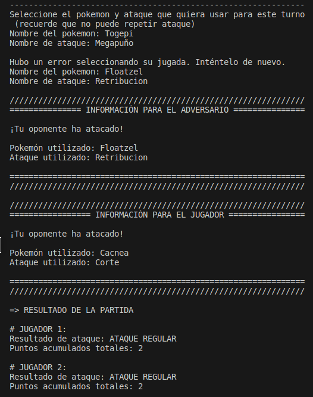
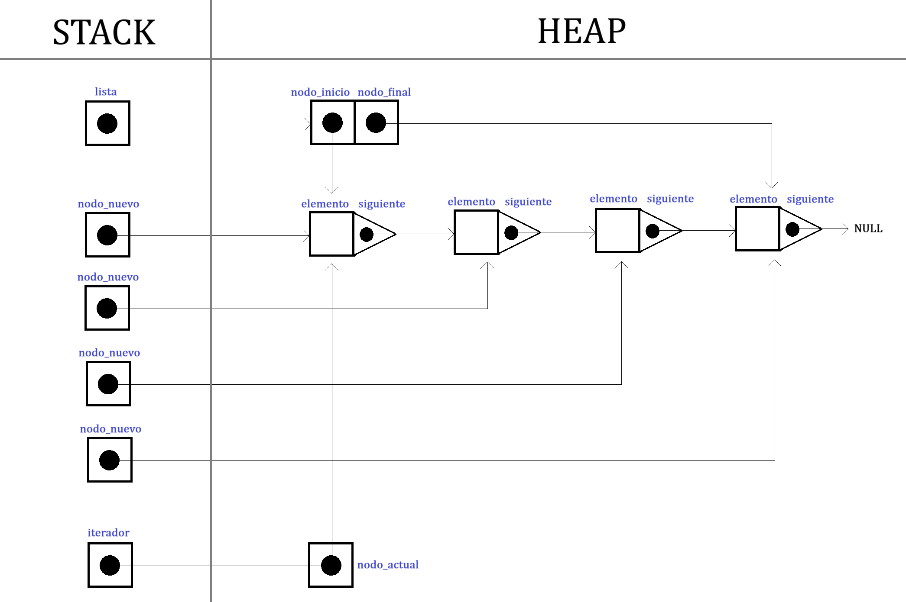
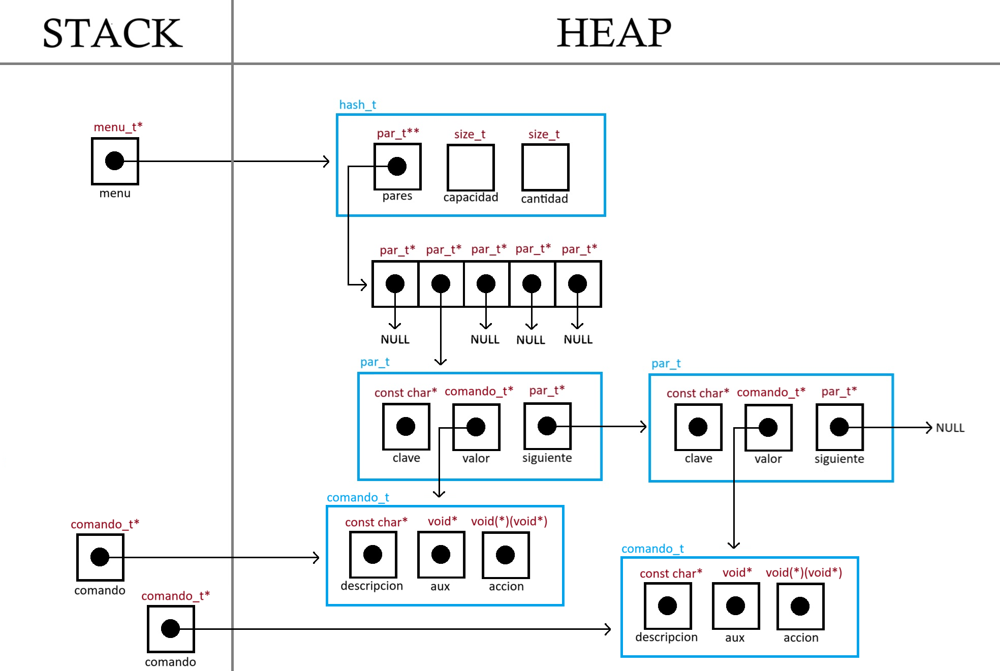

<div align="right">

</div>

# TP2

## Repositorio de Valentina Llanos Pontaut - 104413 - vllanos@fi.uba.ar

- Para compilar y ejecutar el juego:
```bash
make
```

- Para compilar y ejecutar las pruebas de la cátedra:
```bash
bash .algo2/test.sh
```
---
##  Funcionamiento

El presente trabajo práctico consistió en integrar los conceptos abordados a lo largo de la cursada de Algoritmos y Programación II del segundo cuatrimiestre de 2023. El desarrollo del mismo consistió en elegir distintos TDA's (que fuimos desarrollando en trabajos prácticos anteriores), utilizando un óptimo uso de memoria y cuidando la complejidad computacional de las diferentes funciones. Teniendo en cuenta todo esto, se desarrolló para este trabajo un juego que simula ser PvP donde cada jugador se enfrenta al otro en una batalla de pokemones. 

### Funcionalidad del juego:
- Se carga un archivo con los pokemones disponibles y sus respectivos ataques (ver ejemplo en `ejemplos/correcto.txt`)
- Cada jugador elige tres pokemones de esa lista sin repetir
- El tercer pokemon cargado se destina a formar parte de los pokemones del oponente
- Comienza el juego:
  - Dura 9 turnos si es que no se decide abandonar el juego antes (opción disponible en el menú)
  - Se elige pokemon y ataque en cada turno
  - Los puntos se acreditan según el poder de ataque y el tipo del pokemon atacado y el tipo del ataque elegido
- Finaliza el juego cuando todos los ataques disponibles fueron utilizados o el jugador elija terminarlo

### Demostración del juego:
- Bienvenida con instrucciones:

<div align="center">
        
</div>

- Subir archivo: Valida que exista y que contenga mínimo 4 pokemones diferentes. Sino pide reintentar cargarlo.

<div align="center">
        
</div>

- Elegir pokemon: Valida que exista y que no se repitan entre sí. Sino pide reintentar cargarlos.

<div align="center">
        
</div>

- A continuación se imprime la distribución final de pokemones entre ambos jugadores y comienza el juego

<div align="center">
        
</div>

- Se elige el pokemon y ataque para jugar el primer turno. Este no debe estar repetido. Por consola se muestra el resultado del primer turno junto al ataque del adversario.

<div align="center">
        
</div>

- Se puede repetir el ataque si es que este se encuentra dos veces en tu lista de pokemones.
<div align="center">
        
        
</div>

- Los ataques pueden tener distintos resultados: ATAQUE EFECTIVO, ATAQUE INEFECTIVO, ATAQUE REGULAR. Y esto determina la potencia de poder de ataque que luego sumará puntos al jugador
<div align="center">
        
        
</div>

- Finalizados los 9 turnos se anuncia si el jugador ganó, perdió o empató con su rival

<div align="center">
        
</div>

- El juego cuenta con un menú que se muestra cada vez que finaliza el turno:
<div align="center">
        
        
</div>
<div align="center">
        
        
</div>

- La opción 7 finaliza el juego por mas que no se hayan jugado los 9 turnos y la 1 continúa al siguiente turno
<div align="center">
        
</div>
<div align="center">
        
</div>


---

## Estructuras imprementadas

### TDA Juego

Para empezar, se implementó un TDA Juego que reutiliza las implementaciones del TDA Lista y del TDA Pokemones desarroladas en trabajos prácticos anteriores (TP1 y TP TDA Lista). Recordando estas estructuras, a continuacióon su diagramas de alocación de memoria, sumado al que quedó para el TDA Juego:
- TDA Lista:
<div align="center">
        
</div>

- TDA Pokemon:
<div align="center">
        
</div>

- TDA Juego:
<div align="center">
        
</div>

La complejidad de sus operaciones se detalla en la siguiente tabla:

<div align="center">
        
</div>

### TDA Adversario

Para el desarrollo del juego se precisó crear un TDA Adversario para simular lo mejor posible una interacción entre dos jugadores. Este selecciona los pokemones que va a utilizar en el juego contra el jugador, toma decisiones de ataque y simula como sería jugar con otro participante del que no sabríamos "como piensa". A continuación muestro el diagrama de alocación de memoria del adversario. 

<div align="center">
        
</div>

**NOTA:** No desarrollo las estructuras lista_t, pokemon_t, ataque_t porque fueron mostradas en diagramas anteriores

La complejidad de sus operaciones se detalla en la siguiente tabla:

<div align="center">
        
</div>

### TDA Menú

Se implementó un TDA Menú para hacer más rápida la búsqueda de comandos a la hora de interactuar con el menú del juego. Para ello se reutilizaron las implementaciones del TDA Hash desarrolladas en TP anteriores a éste. Los valores de las claves esta vez fueron estructuras comando_t donde se guardaron la descripción del comando, la función que ejecuta ese comando y el elemento que precisa la función del comando para funcionar correctamente. Recordando lo que fue el uso de memoria dinámica del TDA Hash, acontinuación su diagrama de alocación de memoria junto al modificado para el TDA Menú:

<div align="center">
        
        
</div>

La complejidad de sus operaciones se detalla en la siguiente tabla:

<div align="center">
        
</div>


